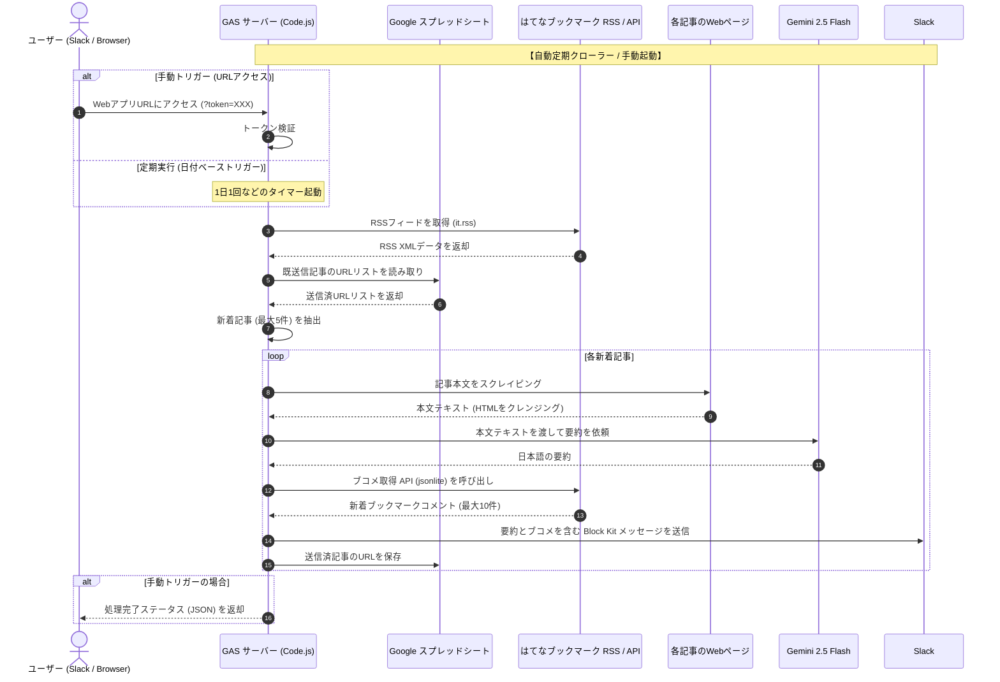

# AI はてなブックマーク ダイジェスト (ai-hatebu-digest)

はてなブックマークのホットエントリー（テクノロジーカテゴリ）から記事を自動取得し、Geminiで要約したものをSlackに通知する、**Google Apps Script (GAS)** と **Google スプレッドシート** を使った完全無料のシステムです。

---

## 🚀 システム概要



### 💡 主な機能・仕様
1. **全自動定期実行 (1日1回など)**:
   - はてなブックマークのテクノロジーホットエントリーから新着記事を自動取得。
   - スプレッドシートの送信済履歴と比較し、重複するURLは自動除外（送信済履歴は最大100件まで保持され、古いものから自動削除されます）。
   - 各記事の本文をスクレイピングし、Gemini APIを使用して要約。
   - はてなブックマークのEntry APIから新着コメント（ブコメ）を最大10件取得。
   - 新規記事（最大5件）をSlackチャンネルへ整形して通知。
2. **堅牢性とエラーハンドリング**:
   - **実行時間・API制限への配慮**: GASの実行時間制限やGemini APIの無料枠制限（15 RPM）を考慮し、1回あたりの最大処理件数を **5件** に制限。また、APIリクエストの間に **1.5秒のウェイト** を挿入。
   - **例外処理の徹底**: 各記事の処理を独立した `try-catch-finally` で囲み、一部の記事でスクレイピングや要約が失敗しても、残りの記事の処理に影響を与えない堅牢な設計。
   - **アクセス不可記事のスキップ・記録**: 記事本文が403/404エラー等で取得できない場合や、文字数が空の場合は要約をスキップし、Slackに警告（⚠️）を通知。スキップされた記事も送信済履歴（スプレッドシート）に追加されるため、二重に処理されることはありません。
3. **Slack上での情報完結**:
   - Slackの Block Kit 形式で、記事タイトル、Gemini要約、新着ブコメがスッキリとまとまったメッセージを配信。
   - モバイルやPCのSlackアプリからダイレクトに要約とユーザーの反応を確認可能。
4. **手動更新 (Webhook)**:
   - GASでデプロイしたWebアプリURLにアクセス（トークン付き）することで、いつでも手動で最新の情報を取得・要約・Slack送信可能。
5. **ランニングコスト0円**:
   - ホスティング & API: Google Apps Script (0円)
   - データベース: Google スプレッドシート (0円)
   - AI要約: Gemini API (Google AI Studio: 0円, 15 RPM)

---

## 🛠️ スクリプトプロパティ設定 (環境変数)

GASのプロジェクト設定で、以下のスクリプトプロパティ（Script Properties）を設定します。

| プロパティ名 | 必須/任意 | 説明 |
| :--- | :--- | :--- |
| `GEMINI_API_KEY` | 必須 | Google AI Studioから取得したGemini APIキー |
| `SLACK_WEBHOOK_URL` | 必須 | 通知させたいSlackチャンネルのIncoming Webhook URL |
| `APP_SECRET` | 必須 | 手動更新用URLに含める任意のパスワード（トークン）文字列 |
| `HATENA_RSS_URL` | 任意 | 取得対象のRSS。デフォルトは `https://b.hatena.ne.jp/hotentry/it.rss` |

---

## 📱 手動更新の利用方法

1. **アクセスURL**:
   - GASでデプロイしたWebアプリのURLに、設定した `APP_SECRET` をパラメータとして付与してアクセス（ブラウザや外部APIクライアント等からGETリクエスト）します。
   - 例: `https://script.google.com/macros/s/XXXXX/exec?token=YOUR_SECRET_STRING`
2. **レスポンス**:
   - 正常に完了すると `{"success": true, "processedCount": X}` のようなJSONが返却されます。

---

## ⚙️ セットアップ手順

1. **スプレッドシートの作成**:
   - 新規の Google スプレッドシートを作成します。
   - シート名を「Articles」にしておきます（送信済URLの履歴保存用。送信済履歴は自動的に最大100件まで保持され、古いものから自動削除されます）。
2. **Apps Script を開く**:
   - メニューの「拡張機能」 > 「Apps Script」を選択します。
3. **コードの配置**:
   - デフォルトで作成されている `コード.gs`（または `Code.gs`）に、[src/Code.js](src/Code.js) のコードを貼り付けます。
4. **スクリプトプロパティの設定**:
   - 左メニューの歯車アイコン（プロジェクトの設定）をクリックします。
   - 画面下部の「スクリプトプロパティ」セクションで、「スクリプトプロパティを追加」をクリックし、`GEMINI_API_KEY`、`SLACK_WEBHOOK_URL`、`APP_SECRET` を設定し保存します。
5. **ウェブアプリのデプロイ (手動更新を利用する場合のみ)**:
   - 右上の「デプロイ」 > 「新しいデプロイ」をクリックします。
   - ギアアイコン（種類の選択）をクリックし、「ウェブアプリ」を選択します。
   - 以下のように設定します：
     - 次のユーザーとして実行: **自分**
     - アクセスできるユーザー: **全員**
   - 「デプロイ」をクリックし、承認プロンプトが表示された場合は許可します。
   - 発行された **「ウェブアプリのURL」** をコピーします。
6. **定期実行トリガーの設定**:
   - 左メニューの目覚まし時計アイコン（トリガー）をクリックします。
   - 右下の「トリガーを追加」をクリックします。
   - 以下のように設定します：
     - 実行する関数を選択: `runCron`
     - 実行するデプロイを選択: `Head`
     - イベントのソースを選択: **時間主導型**
     - 時間ベースのトリガーのタイプを選択: **日付ベースのタイマー**
     - 時刻を選択: **午前 7時〜8時**（お好みの時間）
   - 「保存」をクリックします。

---

## 🧪 ローカルテストの実行

本プロジェクトでは、Google Apps Script (GAS) のグローバルオブジェクトを Jest 上でモック化し、ローカル環境で単体テストを実行できるようにしています。

### テストの実行手順
1. **依存パッケージのインストール**:
   ```bash
   npm install
   ```
2. **テストの実行**:
   ```bash
   npm test
   ```

### テストの構成・特徴
- **モック化**: `PropertiesService`, `UrlFetchApp`, `XmlService`, `SpreadsheetApp`, `ContentService`, `Utilities` などの GAS 固有クラスを Jest で擬似的に再現し、通信やストレージを伴わない高速なテストを実現しています。
- **検証範囲**: [src/Code.test.js](src/Code.test.js) にて、トークン認証、エラーハンドリング、二重送信防止、一時的な API 障害時のリトライ/リカバリ処理、およびアクセス不可記事のスキップ仕様など、全23件のテストケースを網羅しています。
- **本番との互換性**: [src/Code.js](src/Code.js) の末尾で `module.exports` をエクスポートする際、GASのランタイム環境を壊さないためのガード処理（`typeof module !== 'undefined'`）を施しています。

---

## 🤖 CI/CD デプロイ自動化

GitHub Actions を利用し、`main` ブランチへのマージ/プッシュをトリガーにテスト実行と GAS へのデプロイを自動で行います。

### CI/CD フロー
1. `main` ブランチへプッシュ
2. GitHub Actions ワークフロー（[.github/workflows/deploy.yml](.github/workflows/deploy.yml)）が起動
3. `npm ci` による依存関係のクリーンインストール
4. `npm test` による Jest テストの実行 (全テストがパスすることを確認)
5. シークレットから `.clasprc.json` と `.clasp.json` を生成
6. `clasp push -f` を実行し、[src/Code.js](src/Code.js) などのソースコードを GAS にデプロイ

### GitHub Secrets の設定
リポジトリの Settings > Secrets and variables > Actions に以下のシークレットを登録する必要があります。

| Secret名 | 内容 |
| :--- | :--- |
| `CLASPRC_JSON` | `~/.clasprc.json` の内容（ローカルで `npx clasp login` を実行して生成された認証用JSONデータ） |
| `CLASP_JSON` | `.clasp.json` の内容（`scriptId` や `rootDir` などの設定情報を含むJSONデータ。セキュリティのためリポジトリにはコミットされません） |