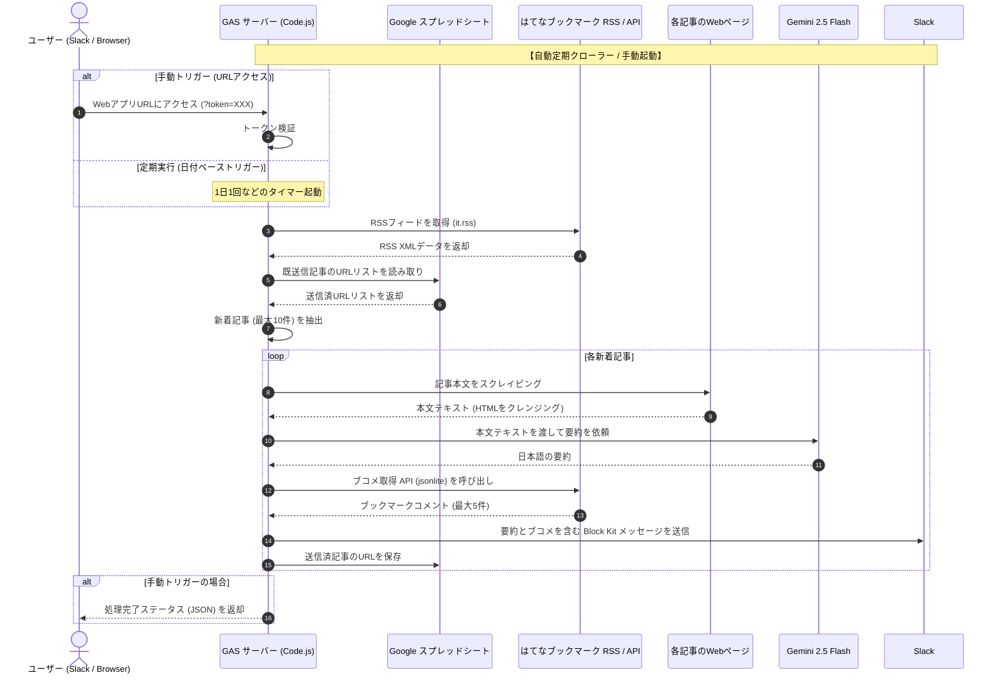

# AI はてなブックマーク ダイジェスト (ai-hatebu-digest)

はてなブックマークのホットエントリー（テクノロジーカテゴリ）から記事を自動取得し、Geminiで要約したものをSlackに通知する、**Google Apps Script (GAS)** と **Google スプレッドシート** を使った完全無料のシステムです。

---

## 🚀 システム概要

### 💡 主な機能
1. **全自動定期実行 (1日1回など)**:
   - はてなブックマークのテクノロジーホットエントリーから新着記事を自動取得。
   - スプレッドシートの送信済履歴と比較し、重複するURLは自動除外。
   - 各記事の本文をスクレイピングし、Gemini APIを使用して要約。
   - はてなブックマークのEntry APIからコメント（ブコメ）を最大5件取得。
   - 新規記事（最大10件）をSlackチャンネルへ整形して通知。
2. **Slack上での情報完結**:
   - Slackの Block Kit 形式で、記事タイトル、Gemini要約、人気ブコメがスッキリとまとまったメッセージを配信。
   - iPhoneやPCのSlackアプリからダイレクトに要約とユーザー反応を確認可能。
3. **手動更新 (Webhook)**:
   - GASでデプロイしたWebアプリURLにアクセス（トークン付き）することで、いつでも手動で最新の情報を取得・要約・Slack送信可能。
4. **ランニングコスト0円**:
   - ホスティング & API: Google Apps Script (0円)
   - データベース: Google スプレッドシート (0円)
   - AI要約: Gemini API (Google AI Studio: 0円, 15 RPM)

---

## 🛠️ スクリプトプロパティ設定 (環境変数)

GASのプロジェクト設定で、以下のスクリプトプロパティ（Script Properties）を設定します。

| プロパティ名 | 必須/任意 | 説明 |
| :--- | :--- | :--- |
| `GEMINI_API_KEY` | 必須 | Google AI Studioから取得したGemini APIキー |
| `SLACK_WEBHOOK_URL` | 必須 | 通知させたいSlackチャンネルのIncoming Webhook URL |
| `APP_SECRET` | 必須 | 手動更新用URLに含める任意のパスワード（トークン）文字列 |
| `HATENA_RSS_URL` | 任意 | 取得対象のRSS。デフォルトは `https://b.hatena.ne.jp/hotentry/it.rss` |

---

## 📱 手動更新の利用方法

1. **アクセスURL**:
   - GASでデプロイしたWebアプリのURLに、設定した `APP_SECRET` をパラメータとして付与してアクセス（ブラウザや外部APIクライアント等からGETリクエスト）します。
   - 例: `https://script.google.com/macros/s/XXXXX/exec?token=YOUR_SECRET_STRING`
2. **レスポンス**:
   - 正常に完了すると `{"success": true, "processedCount": X}` のようなJSONが返却されます。

---

## ⚙️ セットアップ手順

1. **スプレッドシートの作成**:
   - 新規の Google スプレッドシートを作成します。
   - シート名を「Articles」にしておきます（送信済URLの履歴保存用）。
2. **Apps Script を開く**:
   - メニューの「拡張機能」 > 「Apps Script」を選択します。
3. **コードの配置**:
   - デフォルトで作成されている `コード.gs`（または `Code.gs`）に、`src/Code.js` のコードを貼り付けます。
4. **スクリプトプロパティの設定**:
   - 左メニューの歯車アイコン（プロジェクトの設定）をクリックします。
   - 画面下部の「スクリプトプロパティ」セクションで、「スクリプトプロパティを追加」をクリックし、`GEMINI_API_KEY`、`SLACK_WEBHOOK_URL`、`APP_SECRET` を設定し保存します。
5. **ウェブアプリのデプロイ (手動更新を利用する場合のみ)**:
   - 右上の「デプロイ」 > 「新しいデプロイ」をクリックします。
   - ギアアイコン（種類の選択）をクリックし、「ウェブアプリ」を選択します。
   - 以下のように設定します：
     - 次のユーザーとして実行: **自分**
     - アクセスできるユーザー: **全員**
   - 「デプロイ」をクリックし、承認プロンプトが表示された場合は許可します。
   - 発行された **「ウェブアプリのURL」** をコピーします。
6. **定期実行トリガーの設定**:
   - 左メニューの目覚まし時計アイコン（トリガー）をクリックします。
   - 右下の「トリガーを追加」をクリックします。
   - 以下のように設定します：
     - 実行する関数を選択: `runCron`
     - 実行するデプロイを選択: `Head`
     - イベントのソースを選択: **時間主導型**
     - 時間ベースのトリガーのタイプを選択: **日付ベースのタイマー**
     - 時刻を選択: **午前 7時〜8時**（お好みの時間）
   - 「保存」をクリックします。

---

## 🛠️ 実装計画 (Implementation Plan)

### 概要と目標
はてなブックマークRSSの収集、記事スクレイピング、Gemini APIによる要約、はてブコメント取得、およびSlack通知を統合したGASスクリプトを `src/Code.js` として実装します。フロントエンドUI (`Index.html`) は不要になったため作成しません。

### 提案される変更詳細

#### バックエンド: [Code.js](src/Code.js) [NEW]
- **`doGet(e)`**: WebアプリのURLパラメータ `token` を検証し、一致すれば `triggerSync()` を実行して結果をJSON形式で返却する。
- **`checkToken(token)`**: `token` が `APP_SECRET` に一致するか判定する。
- **`runCron()`**: 定期実行用エントリポイント。トークン不要でクローラーおよび通知を実行する。
- **クローラー・通知ロジック (`syncAndNotify()`)**:
  - はてなブックマークのRSSから最新記事を取得（デフォルト: `https://b.hatena.ne.jp/hotentry/it.rss`）。
  - スプレッドシートの「Articles」シートから送信済URL履歴を読み込み、重複しない新着記事（最大10件）を抽出。
  - 各記事について以下を実行：
    1. `UrlFetchApp.fetch` で本文ページをスクレイピングし、スクリプトやスタイル、不要なタグを除去してプレーンテキストを抽出（上限8,000文字）。
    2. Gemini 2.5 Flash API にリクエストを送り、記事内容の「日本語要約（制約なし）」を生成。
    3. はてなブックマークの JSONLite API (`https://b.hatena.ne.jp/entry/jsonlite/?url=...`) を呼び出し、コメント（最大5件、空でないもの）を取得。
    4. 収集した要約とコメントから Slack の Block Kit メッセージ（見出し、要約、ブコメ、リンク）を構築。
    5. Slack Webhook へPOST送信。
    6. スプレッドシートの「Articles」シートの先頭にURLを追記（履歴件数が100件を超える場合は古い行を自動削除し、パフォーマンスを維持）。

### 検証とロードマップ

#### 検証ステータス (検証完了)
- GASエディタからの `runCron` 手動実行による統合テストが成功し、RSS取得〜要約〜Slack通知までの全フローが正常に機能することが確認できました。
- 各個別機能（スクレイピング、Gemini要約、ブコメ取得等）も実環境で問題なく動作したため、個別のデバッグ用テスト関数の追加実装は一旦不要としています。

#### 今後のロードマップ (発展の方向性)
本プロジェクトの今後の改善・拡張アイデアとして以下を想定しています。
1. **ローカル開発・テスト環境の構築**:
   - `clasp` と `Jest` を導入し、ローカルでの単体テスト実行とCLIからのGASへのデプロイを可能にする。
   - GitHub Actions 等と連携し、テストやデプロイの自動化 (CI/CD) を実現する。
2. **Slack通知の機能拡張**:
   - Block Kit のインタラクティブ機能（ボタン等）を活用し、Slack上からの追加アクションなどを検討する。